  

 

Sou estudante de **Análise e Desenvolvimento de Sistemas** e **Publicidade e Propaganda**.

Gosto de unir **desenvolvimento, design e estratégia** para criar experiências digitais modernas, funcionais e com identidade visual.

 

 

<table>
<tr>
<td width="33%" valign="top">

### Artrixy Studio ✦
Portfólio pessoal criado para apresentar meus projetos, habilidades e experiências em **desenvolvimento e design**.

`HTML` `CSS` `JavaScript`

</td>
<td width="33%" valign="top">

### Zona Barmy ✦
Plataforma web para organização de **informações, mapas, checklists, links e conteúdos**.

`HTML` `CSS` `JavaScript` `Maps`

</td>
<td width="33%" valign="top">

### Barmy360 ✦
Projeto digital desenvolvido para **centralização de conteúdos e experiências interativas**.

`Web` `UI/UX` `Firebase`

</td>
</tr>
</table>

---

 

## ✦ Vamos nos conectar

### ✦ criatividade que gera resultados.

feito com ♡ por Alícia Eduarda

